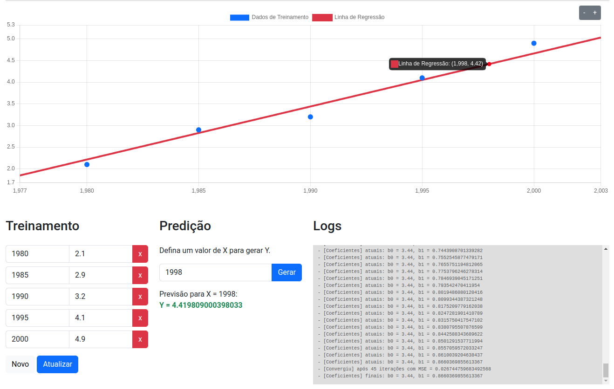

# Regressão Linear
Projeto da disciplina de **Inteligência Artificial** do curso de Sistemas de Informação na UNI7, no qual é implementado o algoritmo de [Regressão Linear](https://pt.wikipedia.org/wiki/Regress%C3%A3o_linear).



## Instalação
Basta clonar o respositório e abrir o index.html no navegador.
```sh
git clone git@github.com:hugojunior/uni7-regressao-linear.git && cd uni7-regressao-linear
```

## Bibliotecas:
- ChartJS
- Bootstrap 5